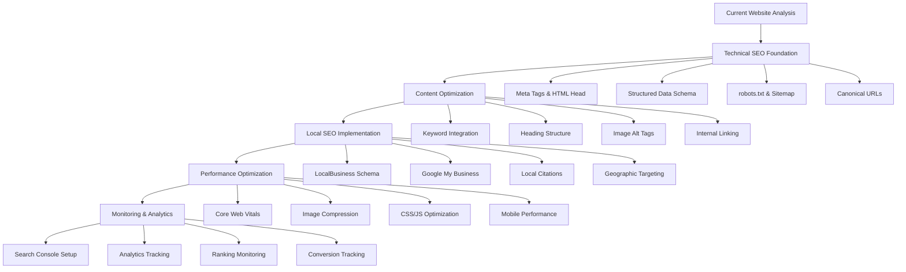
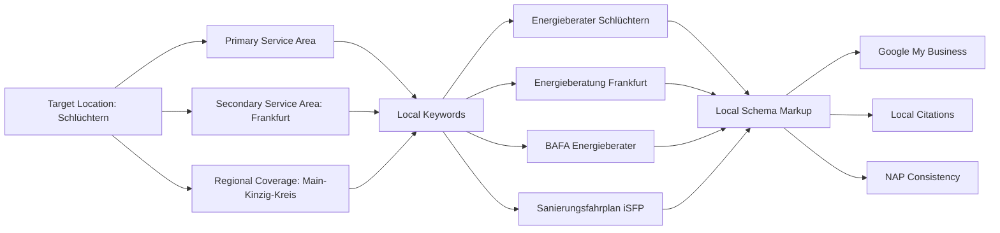
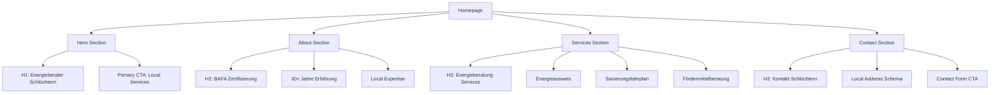
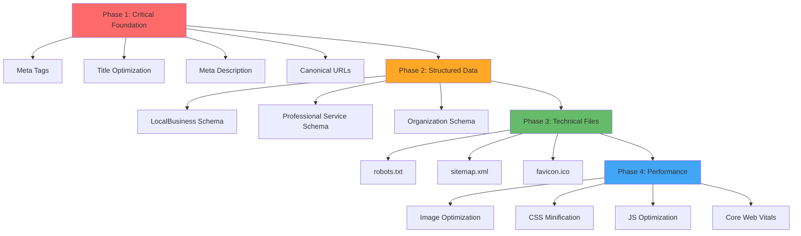
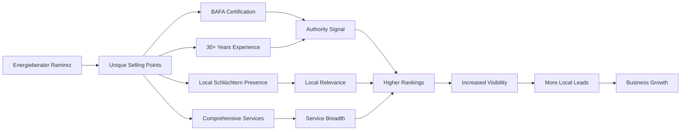
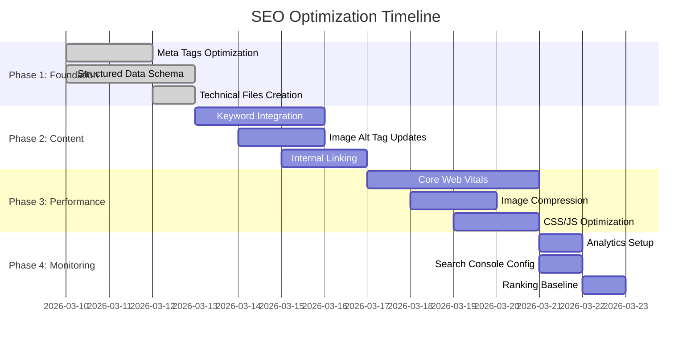

# SEO Optimization Workflow - Visual Guide

## SEO Implementation Flow

## Local SEO Strategy Map

## Content Optimization Hierarchy

## Technical SEO Implementation Priority

## SEO Success Measurement Framework

```mermaid
graph TD
    A[SEO Performance Metrics] --> B[Technical Metrics]
    A --> C[Ranking Metrics]
    A --> D[Traffic Metrics]
    A --> E[Conversion Metrics]
    
    B --> B1[Core Web Vitals Score]
    B --> B2[Mobile Usability]
    B --> B3[Indexing Status]
    B --> B4[Schema Validation]
    
    C --> C1[Local Keyword Rankings]
    C --> C2[Google My Business Visibility]
    C --> C3[SERP Features]
    C --> C4[Competitor Analysis]
    
    D --> D1[Organic Traffic Growth]
    D --> D2[Local Traffic Percentage]
    D --> D3[Bounce Rate Improvement]
    D --> D4[Session Duration]
    
    E --> E1[Contact Form Submissions]
    E --> E2[Phone Call Conversions]
    E --> E3[Email Inquiries]
    E --> E4[Service Page Engagement]
```

## Local SEO Competitive Advantage

## Implementation Timeline

## Key Success Factors

### 1. Local Relevance
- Emphasize Schlüchtern location in all content
- Include regional service areas (Frankfurt, Main-Kinzig-Kreis)
- Use local landmarks and references where appropriate

### 2. Technical Excellence
- Fast loading times (< 3 seconds)
- Mobile-first responsive design
- Clean, semantic HTML structure
- Proper schema markup implementation

### 3. Content Authority
- Highlight BAFA certification prominently
- Showcase 30+ years of experience
- Display professional memberships (GIH)
- Include detailed service descriptions

### 4. User Experience
- Clear navigation structure
- Prominent contact information
- Easy-to-use contact form
- Professional visual design

### 5. Conversion Optimization
- Strategic placement of contact CTAs
- Phone number visibility
- Service-specific landing sections
- Trust signals (certifications, experience)

This workflow provides a clear visual guide for implementing the SEO optimization strategy, ensuring all team members understand the process and priorities.